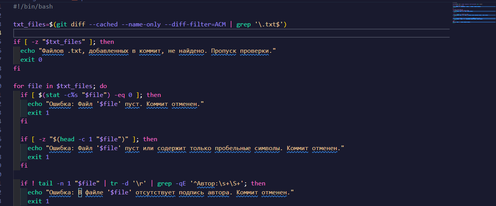

# Лабораторный отчет 5

### ФИО: Нгуен Динь Нам - К3140

## Выполните лабораторную работу 5.

### Задание 1 - Автоматизация проверки формата файлов при коммите

1.  Создание скрипта для проверки файлов

- Для проверки файлов перед фиксацией я создаю Git Hook `pre-commit`.

- Проверьте разрешения на выполнение и предоставьте разрешения на выполнение файлов.
- Запишите этот скрипт в файл, чтобы проверять файлы .txt перед фиксацией




1. Тестирование скрипта

- создайте файл `books.txt` с содержимым:


- Затем коммит:


_Действительный файл .txt._

- Проверка недействительного файла

- Создать файл `invalid.txt` и не записывать в него ничего

- После этого закоммитить, чтобы проверить


_Файл недействителен, потому что он пустой._

- Добавьте содержимое в файл для коммита


_Файл успешно закоммичен._

### Задание 2 - Использование Git Flow в проекте

1. Инициализируем Git Flow в репозитории: При инициализации используем стандартные имена **_веток (main, develop)_**.


_Автоматически переключиться на ветку develop_

2. Создаем ветку для новой функциональности

```
git flow feature start task-management
```


- Используйте команду git branch для проверки


3. Создать файл `task_manager.py` и записать содержимое в файл


4. Делаем коммит:
   

5. Завершаем фичу и сливаем ее в develop:

   
   

- Дать этому файлу права на выполнение.

6. После этого создайте ветку `release`:


- Используйте команду `git branch` для проверки


7. В ветке release создайте файл `version.txt`, запишите в файл содержимое и закоммитьте"


8. Завершаем релиз:


9. Создаем `hotfix`:


10. Вносим исправления в файл `file_with_error.py`:


11. Затем сделайте коммит:


12. После завершения используйте команду `git flow hotfix finish hotfix-1.0.1` чтобы объединить ветки main и develop.


13. Отправка изменений на удаленный репозиторий


- И вот результат:


